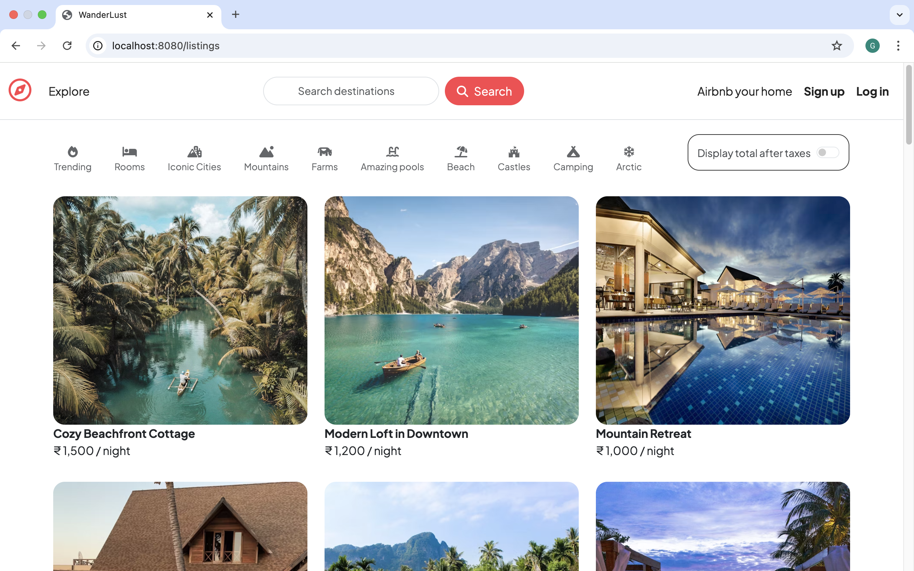
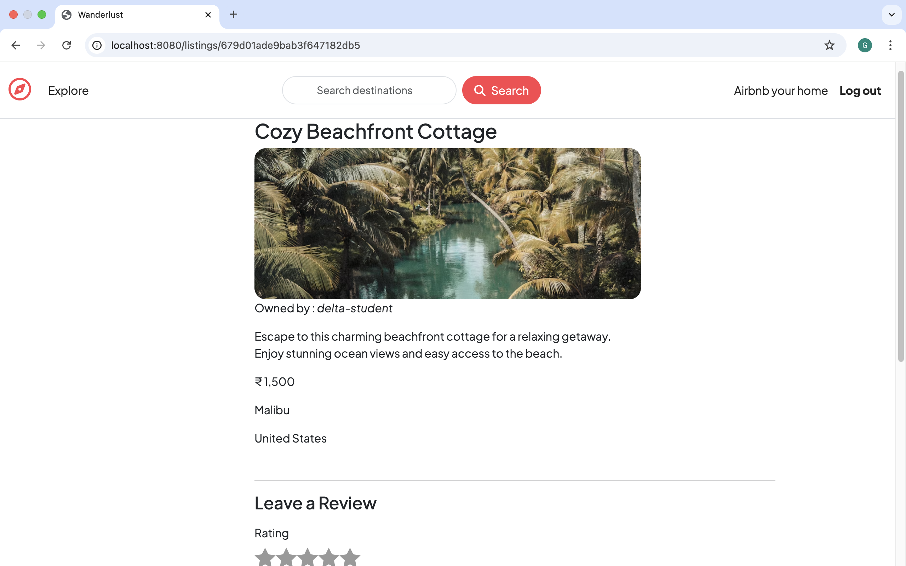
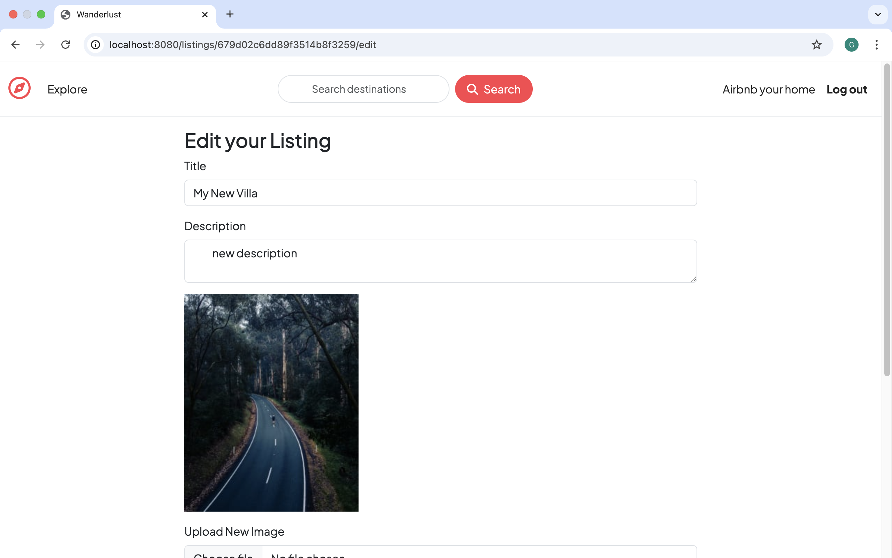
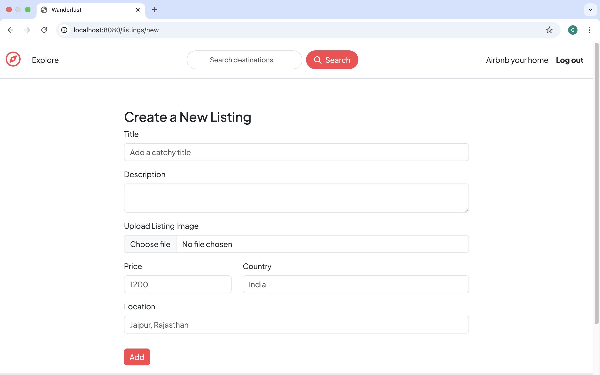

# 🌍 Wanderlust — Travel Listing Platform

Wanderlust is a full-stack web application inspired by Airbnb. It allows users to create, edit, browse, and review travel listings. The project is built with the **MVC architecture** for clean code organization and uses modern web development tools like **Node.js**, **Express.js**, **MongoDB**, and **Passport.js** for authentication.

---

## 📸 Screenshots

> Add the following image files to a `/screenshots` folder in your repo and replace the placeholders below with actual file names.

### 🏠 Home Page

### 📄 Show Listing Page

### ✏️ Edit Listing Page

### ➕ Add New Listing Page

---

## 🔧 Tech Stack

| Technology      | Purpose                        |
| --------------- | ------------------------------ |
| **Node.js**     | Backend runtime environment    |
| **Express.js**  | Web framework for Node.js      |
| **MongoDB**     | NoSQL database                 |
| **Mongoose**    | ODM to interact with MongoDB   |
| **EJS**         | Templating engine for views    |
| **Passport.js** | User authentication            |
| **HTML/CSS**    | Frontend structure and styling |

---

## 🚀 Features

- 👤 User authentication (register/login/logout)
- 🔒 Authorization to protect routes (only owner can edit/delete)
- 🧾 Full CRUD functionality for travel listings
- ✍️ Review system for each listing
- 📱 Responsive UI with clean layout
- 🗂️ Follows MVC architecture for scalability

---
